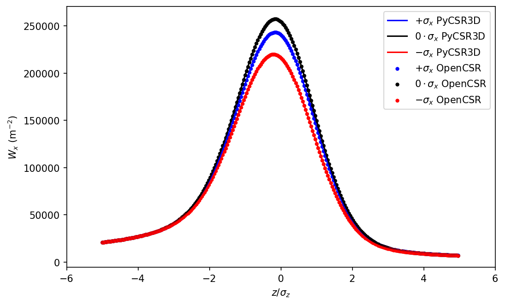
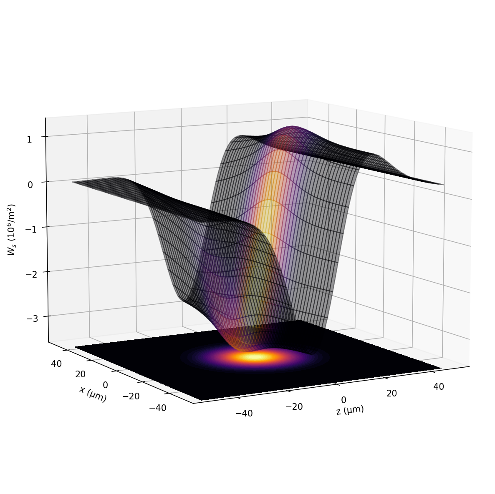
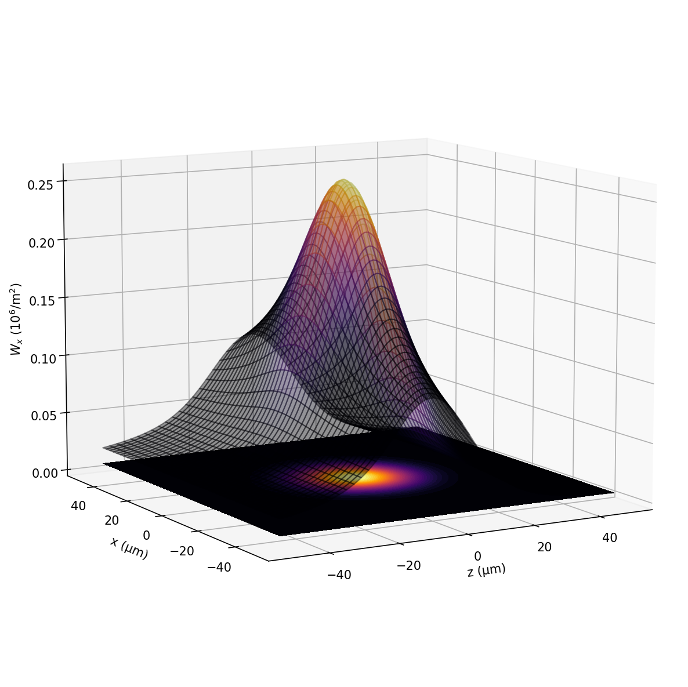
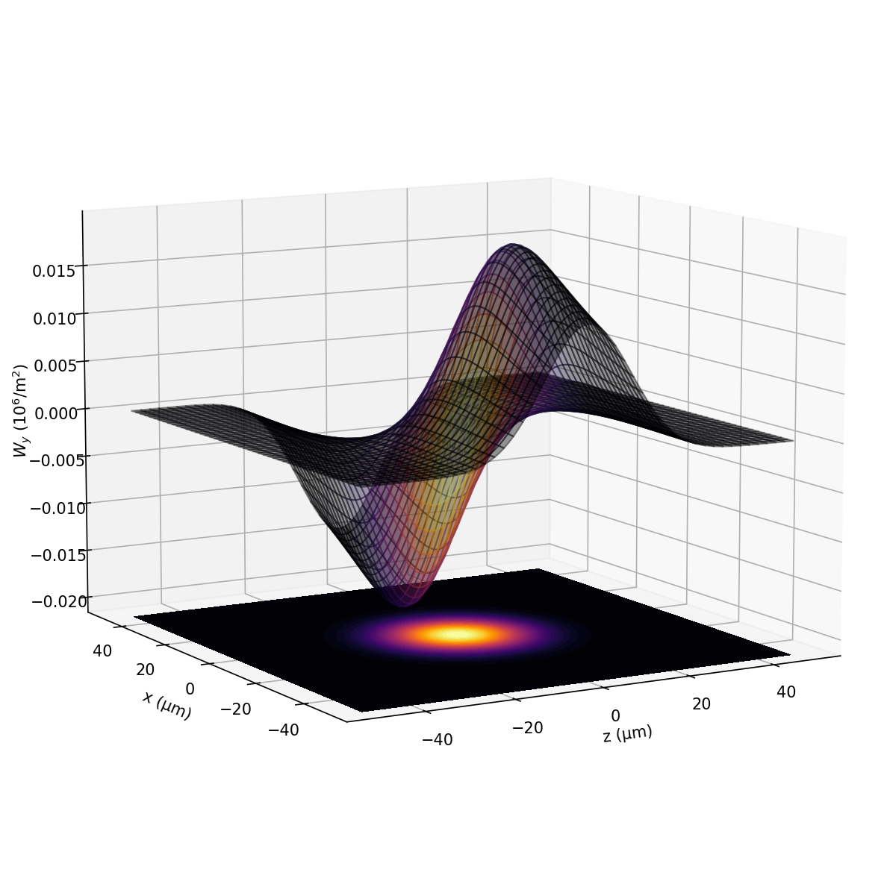

# OpenCSR
3D Coherent Synchrotron Radiation computation based on the formalism developed in:


"Three-dimensional effects of coherent synchrotron radiation by electrons in a bunch compressor" 

Yunhai Cai and Yuantao Ding
Phys. Rev. Accel. Beams 23, 014402 – Published 9 January 2020
https://journals.aps.org/prab/abstract/10.1103/PhysRevAccelBeams.23.014402

Also see:
- www.github.com/ChristopherMayes/PyCSR3D
- www.github.com/weiyuanlou/PyCSR2D

# Compiling The Code

If you are new to CMake, [this short tutorial](https://hsf-training.github.io/hsf-training-cmake-webpage/) from the HEP Software foundation is the perfect place to get started with it.

If you just want to use CMake to build the project, jump into sections *1. Introduction*, *2. Building with CMake* and *9. Finding Packages*.

## Unix

```shell script
cmake -S . -B build
cmake --build build
# the library in now in build

# this command needs sudo if you install into system paths:
cmake --build build --target install
```

If you like to install OpenCSR into another directory than the default, pass to the `cmake -S . -B build` line the additional argument `-DCMAKE_INSTALL_PREFIX=/your/custom/install/path`.

To build the debug version, add the flag:
`-DCMAKE_BUILD_TYPE=Debug`

## Windows

For Windows it will be necessary to use `NMake` to read and execute the generated makefiles.

`NMake` is command-line tool included with Visual Studio that builds projects based on commands that are contained in a description file.

More information on `NMake` can be found on the [NMAKE Reference](https://docs.microsoft.com/en-us/cpp/build/reference/nmake-reference?view=msvc-160) website.

```shell script
cmake -S . -B build -G "NMake Makefiles"
cmake --build build
cmake --build build --target install
cmake --install
```


## Gaussian CSR Wakefield

OpenCSR is designed to agree exactly with PyCSR3D









